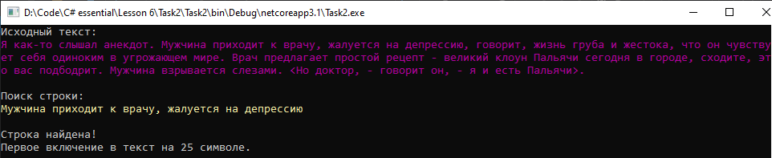

# Lesson6_task2
Условия задачки:
>Используя Visual Studio, создайте проект по шаблону Console Application.  
Требуется:  
Создать статический класс FindAndReplaceManager с методом void FindNext(string str) для поиска по книге из решения урока 005_Book. При вызове этого метода, производится последовательный поиск строки в книге. 

Подытог: вот такенный майндфак на выходе
>

